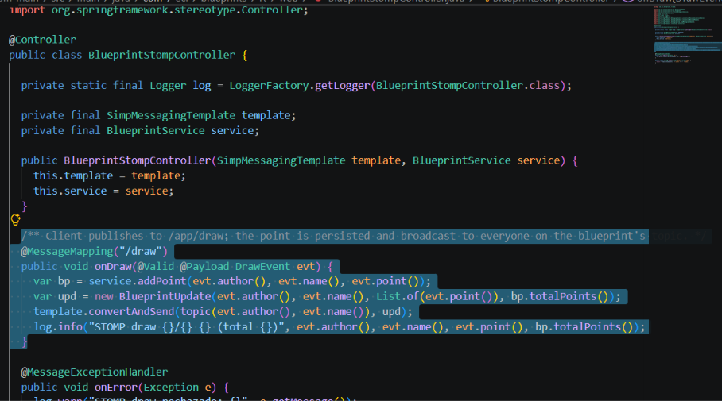
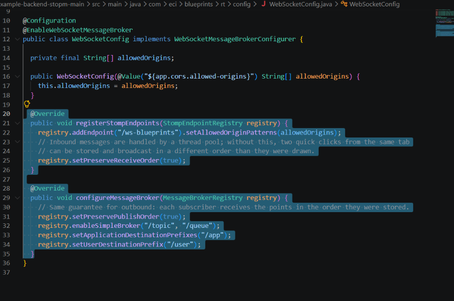
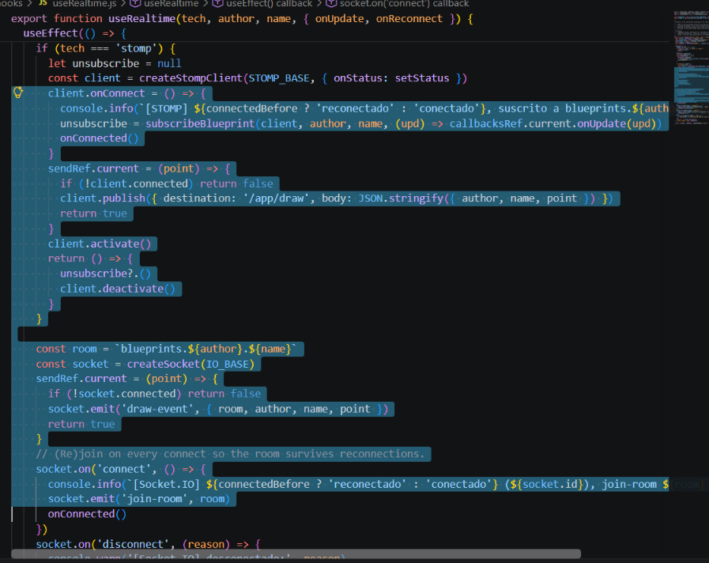
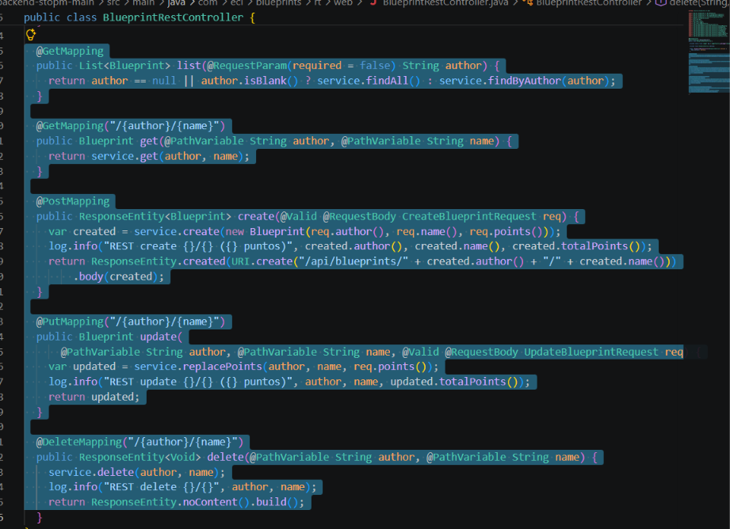
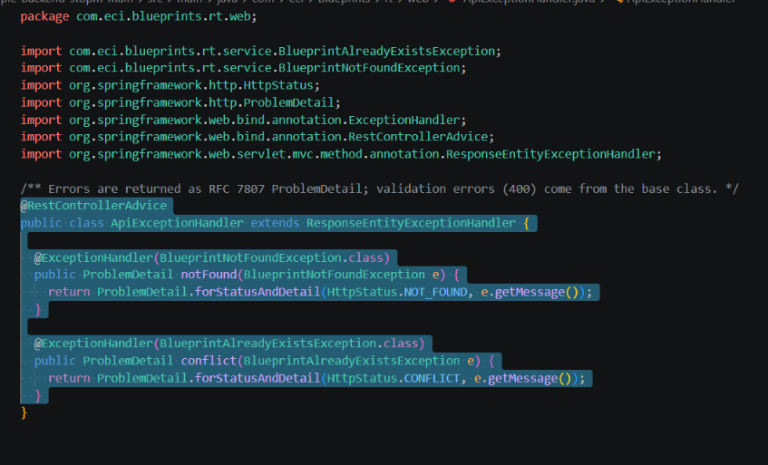
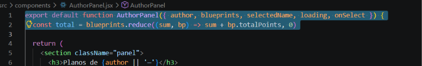
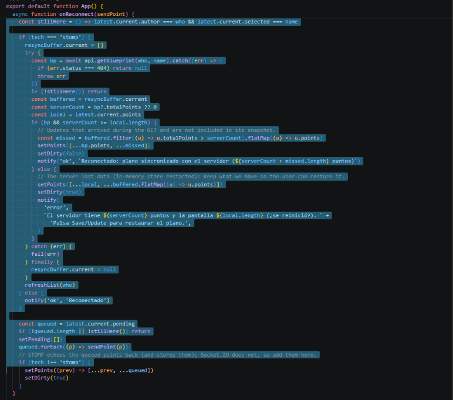

# Lab P4 — BluePrints en Tiempo Real (Sockets & STOMP)
## Integrantes: Rafael Moreno - Sebastián Castillejo

> **Repositorio:** `DECSIS-ECI/Lab_P4_BluePrints_RealTime-Sokets`  
> **Front:** React + Vite (Canvas, CRUD, y selector de tecnología RT)  
> **Backends guía (elige uno o compáralos):**
> - **Socket.IO (Node.js):** https://github.com/DECSIS-ECI/example-backend-socketio-node-/blob/main/README.md
> - **STOMP (Spring Boot):** https://github.com/DECSIS-ECI/example-backend-stopm/tree/main

## README del equipo

Elegimos STOMP (Spring Boot) como backend principal. El backend esta en la carpeta
[example-backend-stopm-main/](example-backend-stopm-main/) y sirve a la vez la API CRUD (REST) y el tiempo real (STOMP).

El front también soporta lo de Socket.IO contra el backend guía de Node

### Setup
```bash
# 1) Backend (Java 21 + Maven) → http://localhost:8080
cd example-backend-stopm-main
mvn spring-boot:run          # tests: mvn test

# 2) Front → http://localhost:5173
cp .env.example .env.local   # opcional, los valores por defecto ya apuntan a localhost:8080
npm i
npm run dev
```
Datos semilla: juan/plano-1, juan/plano-2, maria/casa (almacenamiento **en memoria**: se reinicia con el servidor).

### Endpoints usados
| Tipo | Endpoint | Uso |
|---|---|---|
| REST | GET /api/blueprints?author=juan | Tabla del autor (cada plano trae points y totalPoints; el total se calcula con reduce) |
| REST | GET /api/blueprints/{author}/{name} | Estado inicial del canvas |
| REST | POST /api/blueprints {author,name,points} | Create (409 si ya existe) |
| REST | PUT /api/blueprints/{author}/{name} {points} | Save/Update (404 si no existe) |
| REST | DELETE /api/blueprints/{author}/{name} | Delete (204) |
| WS | /ws-blueprints | Endpoint STOMP |
| STOMP | SEND /app/draw {author,name,point:{x,y}} | Enviar punto |
| STOMP | SUBSCRIBE /topic/blueprints.{author}.{name} | Recibir {author,name,points:[punto],totalPoints} |
| HTTP | GET /actuator/health | Health check |

Los errores REST se devuelven como ProblemDetail y el front muestra el campo detail.

### Decisiones de diseño
- **Un tópico por plano** (blueprints.{author}.{name}): aislamiento total entre planos; cambiar de plano cancela la suscripción anterior.
- **El servidor es la fuente de verdad en STOMP**: cada /app/draw se persiste y se reenvía a todos los suscriptores, incluido el emisor. Por eso el front no pinta el punto localmente,lo que hace es pintar al recibir el eco, así todas las pestañas quedan en el mismo orden. Si se dibuja en un plano que no existe, se crea
- **Mensajes delta** para no reenviar el plano completo en cada clic y actualizar la tabla del autor en vivo
- **Socket.IO / None**: el backend guía usa socket.to(room) y no persiste, por lo que que el punto se pinta localmente y queda como *sin guardar* hasta pulsar Save/Update
- **Validación**: author y name solo aceptan [A-Za-z0-9_-]{1,50}. Se valida en REST y en los mensajes STOMP
- **CORS / orígenes** restringidos a http://localhost:5173 para REST y WebSocket; en produccion se configuro con la variable ALLOWED_ORIGINS
- **Observabilidad**: logs de conexión/suscripción/desconexión WS, de cada uno de los draw y de cada uno de las operaciones CRUD; en el front, logs STOMP/Socket.IO en consola e indicador de estado (Conectado / Reconectando…)
- **Reconexión**: STOMP reintenta cada 1s con heartbeats de 10 s; Socket.IO vuelve a hacer join-room en cada connect

  Al reconectar, el front se resincroniza con el servidor y envía los clics que quedaron pendientes (ver *Hallazgo 2*).

### Análisis: latencia, reconexión y STOMP vs Socket.IO

Mediciones reales con [scripts/bench-rt.mjs](scripts/bench-rt.mjs), que simula 2 pestañas en el mismo plano
más una tercera en otro plano. Se puede repetir con los dos backends levantados:
```bash
npm run bench                       # latencia + ráfaga + aislamiento (STOMP y Socket.IO)
npm run bench -- watch stomp 22     # dibuja cada 100 ms; mientras tanto, tumbar/levantar el servidor
```
Entorno: todo en localhost (Java 21, Node 24), así que se mide el costo del servidor, no la red.
STOMP = nuestro backend Spring; Socket.IO = backend guía de Node.

**Latencia A → servidor → B (500 muestras, 3 corridas)**
| | p50 | p95 | p99 | Ráfaga de 1000 puntos | Throughput |
|---|---|---|---|---|---|
| STOMP (Spring) | ~1.0 ms | ~1.4 ms | ~1.8 ms | 290–450 ms, 0 perdidos, en orden | ~2 200–3 400 msg/s |
| Socket.IO (Node) | ~0.3 ms | ~0.4 ms | ~0.6 ms | 40–50 ms, 0 perdidos, en orden | ~20 000–24 000 msg/s |

- Las dos tecnologías quedan por debajo de lo perceptible para dibujar con clics la diferencia no se nota
- Socket.IO es 3 veces más rápido pero la comparación no es pareja ya que nuestro STOMP valida, guarda cada punto y deja logs mientras que el servidor guía de Socket.IO solo reenvía el mensaje
- La primera corrida de STOMP tuvo un máximo de 150ms por el calentamiento de la JVM pero luego el máximo fue menos de 3ms
- 0 mensajes filtrados al otro plano en todas las corridas, con ambas tecnologías

**Hallazgo 1 — STOMP desordenaba ráfagas** En la primera medición la ráfaga de 1000 puntos llegó en
desorden con STOMP. Spring procesa los mensajes que llegan por el canal de entrada con un ool de hilos, así que
dos clics rápidos de la misma pestaña podían guardarse y reenviarse en otro orden, y cada pestaña dibujaba líneas distintas.
Se corrigió con setPreserveReceiveOrder(true) y setPreservePublishOrder(true) en
[WebSocketConfig](example-backend-stopm-main/src/main/java/com/eci/blueprints/rt/config/WebSocketConfig.java).
Hay un test que envía 300 puntos seguidos y verifica el orden; sin el arreglo, el test falla. Socket.IO (Node, un solo hilo) no tiene este problema.

**Reconexión (servidor caído ~5 s mientras 2 pestañas dibujan cada 100 ms)**
| | Detección de la caída | Reconexión | Re-suscripción | Puntos perdidos |
|---|---|---|---|---|
| STOMP | Inmediata (cierre del WebSocket) | ≤ 1 s después de que el servidor está listo; ambas pestañas a la vez (reintento fijo cada 1 s) | Automática (onConnect vuelve a suscribir) | 0 de los enviados |
| Socket.IO | Inmediata (transport close) | Pestaña B a los 1.3 s y pestaña A a los 4 s (espera exponencial aleatoria de 1 a 5 s) | Automática (join-room en cada connect) | 0 de los enviados |

- Con las dos tecnologías, los clics hechos sin conexión no se pierden: quedan en una cola de pendientes y se envían al reconectar (ver *Hallazgo 2*).
- La espera exponencial de Socket.IO evita que todos los clientes golpeen al servidor a la vez al volver, pero hace que por unos segundos
  unas pestañas estén conectadas y otras no. El intervalo fijo de STOMP reconecta más parejo, aunque con muchos clientes provocaría picos de carga.

**Hallazgo 2 — desincronización al reconectar** El almacenamiento es en memoria: tras reiniciar Spring,
el plano tenía 49 puntos en el servidor, pero 105 en pantalla**, y los clientes reconectaban sin enterarse. Lo mismo pasa
(sin reinicio) si solo una pestaña pierde la red: se pierde los puntos que otros dibujaron mientras tanto. Ahora, en cada reconexión

1. **STOMP:** se vuelve a pedir el plano (GET). Las actualizaciones que llegan por el tópico mientras tanto se guardan aparte y se
   usa totalPoints para aplicar solo las que no vienen en la respuesta, sin perder ni duplicar puntos.
   - Si el servidor tiene igual o más puntos que la pantalla → se adopta el estado del servidor (*plano sincronizado*).
   - Si tiene menos (el servidor perdió datos) → se conserva lo de la pantalla, se marca sin guardar y se avisa: *Pulsa
     Save/Update para restaurar*. Save hace PUT y, si el plano ya no existe, POST.
2. **Cola de pendientes:** los clics hechos sin conexión se dibujan en gris punteado y se envían solos al reconectar.
3. **Socket.IO:** no se resincroniza por REST (el servidor guía no guarda nada; el estado vive en las pestañas); solo se envían los pendientes.


**Pros y contras**
| | STOMP (Spring) | Socket.IO (Node) |
|---|---|---|
| BUENO | Protocolo estándar (tópicos, SEND/SUBSCRIBE), se integra con Spring (validación, seguridad, @MessageMapping); REST y tiempo real en un solo servicio; se puede cambiar a un broker externo (RabbitMQ/ActiveMQ) para escalar | Menor latencia y mayor throughput; salas (rooms) muy simples; reconexión, *fallback* a *long-polling* y buffer offline integrados en el cliente |
| MALO | Más configuración; el procesamiento con varios hilos no garantiza orden si no se configura (hallazgo 1); el broker simple en memoria no escala a varias instancias | Protocolo propio (el cliente tiene que ser Socket.IO); escalar a varias instancias requiere *adapter* (Redis); socket.to(room) excluye al emisor, lo que obliga a pintar localmente y complica mantener el mismo orden entre pestañas |

para este caso, las dos cumplen en relacion con la latencia. Pero escoguimos STOMP ya que
el servidor queda como fuente de verdad guardando y reenviando en orden a todos, incluido el emisor, con validación y CRUD en el mismo servicio.

### Evidencias

**Código — tiempo real (STOMP)**

1. Backend: @MessageMapping(/draw) guarda el punto y lo publica en el tópico del plano.
   
2. Configuración STOMP: endpoint /ws-blueprints, prefijos /app y /topic, y orden garantizado (hallazgo 1).
   
3. Front: publicar en /app/draw y suscribirse a /topic/blueprints.{author}.{name} (y join-room / draw-event en Socket.IO).
   

**Código — CRUD y calidad**

4. API REST: GET / POST / PUT / DELETE de /api/blueprints.
   
5. Manejo de errores: 404 (no existe) y 409 (ya existe) como ProblemDetail; los 400 de validación los maneja la clase base.
   
6. Total de puntos del autor con reduce.
   
7. Resincronización al reconectar (hallazgo 2).
   

---

## 🎯 Objetivo del laboratorio
Implementar **colaboración en tiempo real** para el caso de BluePrints. El Front consume la API CRUD de la Parte 3 (o equivalente) y habilita tiempo real usando **Socket.IO** o **STOMP**, para que múltiples clientes dibujen el mismo plano de forma simultánea.

Al finalizar, el equipo debe:
1. Integrar el Front con su **API CRUD** (listar/crear/actualizar/eliminar planos, y total de puntos por autor).
2. Conectar el Front a un backend de **tiempo real** (Socket.IO **o** STOMP) siguiendo los repos guía.
3. Demostrar **colaboración en vivo** (dos pestañas navegando el mismo plano).

---

## 🧩 Alcance y criterios funcionales
- **CRUD** (REST):
  - `GET /api/blueprints?author=:author` → lista por autor (incluye total de puntos).
  - `GET /api/blueprints/:author/:name` → puntos del plano.
  - `POST /api/blueprints` → crear.
  - `PUT /api/blueprints/:author/:name` → actualizar.
  - `DELETE /api/blueprints/:author/:name` → eliminar.
- **Tiempo real (RT)** (elige uno):
  - **Socket.IO** (rooms): `join-room`, `draw-event` → broadcast `blueprint-update`.
  - **STOMP** (topics): `@MessageMapping("/draw")` → `convertAndSend(/topic/blueprints.{author}.{name})`.
- **UI**:
  - Canvas con **dibujo por clic** (incremental).
  - Panel del autor: **tabla** de planos y **total de puntos** (`reduce`).
  - Barra de acciones: **Create / Save/Update / Delete** y **selector de tecnología** (None / Socket.IO / STOMP).
- **DX/Calidad**: código limpio, manejo de errores, README de equipo.

---

## 🏗️ Arquitectura (visión rápida)

```
React (Vite)
 ├─ HTTP (REST CRUD + estado inicial) ───────────────> Tu API (P3 / propia)
 └─ Tiempo Real (elige uno):
     ├─ Socket.IO: join-room / draw-event ──────────> Socket.IO Server (Node)
     └─ STOMP: /app/draw -> /topic/blueprints.* ────> Spring WebSocket/STOMP
```

**Convenciones recomendadas**  
- **Plano como canal/sala**: `blueprints.{author}.{name}`  
- **Payload de punto**: `{ x, y }`

---

## 📦 Repos guía (clona/consulta)
- **Socket.IO (Node.js)**: https://github.com/DECSIS-ECI/example-backend-socketio-node-/blob/main/README.md  
  - *Uso típico en el cliente:* `io(VITE_IO_BASE, { transports: ['websocket'] })`, `join-room`, `draw-event`, `blueprint-update`.
- **STOMP (Spring Boot)**: https://github.com/DECSIS-ECI/example-backend-stopm/tree/main  
  - *Uso típico en el cliente:* `@stomp/stompjs` → `client.publish('/app/draw', body)`; suscripción a `/topic/blueprints.{author}.{name}`.

---

## ⚙️ Variables de entorno (Front)
Crea `.env.local` en la raíz del proyecto **Front**:
```bash
# REST (tu backend CRUD)
VITE_API_BASE=http://localhost:8080

# Tiempo real: apunta a uno u otro según el backend que uses
VITE_IO_BASE=http://localhost:3001     # si usas Socket.IO (Node)
VITE_STOMP_BASE=http://localhost:8080  # si usas STOMP (Spring)
```
En la UI, selecciona la tecnología en el **selector RT**.

---

## 🚀 Puesta en marcha

### 1) Backend RT (elige uno)

**Opción A — Socket.IO (Node.js)**  
Sigue el README del repo guía:  
https://github.com/DECSIS-ECI/example-backend-socketio-node-/blob/main/README.md
```bash
npm i
npm run dev
# expone: http://localhost:3001
# prueba rápida del estado inicial:
curl http://localhost:3001/api/blueprints/juan/plano-1
```

**Opción B — STOMP (Spring Boot)**  
Sigue el repo guía:  
https://github.com/DECSIS-ECI/example-backend-stopm/tree/main
```bash
./mvnw spring-boot:run
# expone: http://localhost:8080
# endpoint WS (ej.): /ws-blueprints
```

### 2) Front (este repo)
```bash
npm i
npm run dev
# http://localhost:5173
```
En la interfaz: selecciona **Socket.IO** o **STOMP**, define `author` y `name`, abre **dos pestañas** y dibuja en el canvas (clics).

---

## 🔌 Protocolos de Tiempo Real (detalle mínimo)

### A) Socket.IO
- **Unirse a sala**
  ```js
  socket.emit('join-room', `blueprints.${author}.${name}`)
  ```
- **Enviar punto**
  ```js
  socket.emit('draw-event', { room, author, name, point: { x, y } })
  ```
- **Recibir actualización**
  ```js
  socket.on('blueprint-update', (upd) => { /* append points y repintar */ })
  ```

### B) STOMP
- **Publicar punto**
  ```js
  client.publish({ destination: '/app/draw', body: JSON.stringify({ author, name, point }) })
  ```
- **Suscribirse a tópico**
  ```js
  client.subscribe(`/topic/blueprints.${author}.${name}`, (msg) => { /* append points y repintar */ })
  ```

---

## 🧪 Casos de prueba mínimos
- **Estado inicial**: al seleccionar plano, el canvas carga puntos (`GET /api/blueprints/:author/:name`).  
- **Dibujo local**: clic en canvas agrega puntos y redibuja.  
- **RT multi-pestaña**: con 2 pestañas, los puntos se **replican** casi en tiempo real.  
- **CRUD**: Create/Save/Delete funcionan y refrescan la lista y el **Total** del autor.

---

## 📊 Entregables del equipo
1. Código del Front integrado con **CRUD** y **RT** (Socket.IO o STOMP).  
2. **Video corto** (≤ 90s) mostrando colaboración en vivo y operaciones CRUD.  
3. **README del equipo**: setup, endpoints usados, decisiones (rooms/tópicos), y (opcional) breve comparativa Socket.IO vs STOMP.

---

## 🧮 Rúbrica sugerida
- **Funcionalidad (40%)**: RT estable (join/broadcast), aislamiento por plano, CRUD operativo.  
- **Calidad técnica (30%)**: estructura limpia, manejo de errores, documentación clara.  
- **Observabilidad/DX (15%)**: logs útiles (conexión, eventos), health checks básicos.  
- **Análisis (15%)**: hallazgos (latencia/reconexión) y, si aplica, pros/cons Socket.IO vs STOMP.

---

## 🩺 Troubleshooting
- **Pantalla en blanco (Front)**: revisa consola; confirma `@vitejs/plugin-react` instalado y que `AppP4.jsx` esté en `src/`.  
- **No hay broadcast**: ambas pestañas deben hacer `join-room` al **mismo** plano (Socket.IO) o suscribirse al **mismo tópico** (STOMP).  
- **CORS**: en dev permite `http://localhost:5173`; en prod, **restringe orígenes**.  
- **Socket.IO no conecta**: fuerza transporte WebSocket `{ transports: ['websocket'] }`.  
- **STOMP no recibe**: verifica `brokerURL`/`webSocketFactory` y los prefijos `/app` y `/topic` en Spring.

---

## 🔐 Seguridad (mínimos)
- Validación de payloads (p. ej., zod/joi).  
- Restricción de orígenes en prod.  
- Opcional: **JWT** + autorización por plano/sala.

---

## 📄 Licencia
MIT (o la definida por el curso/equipo).
